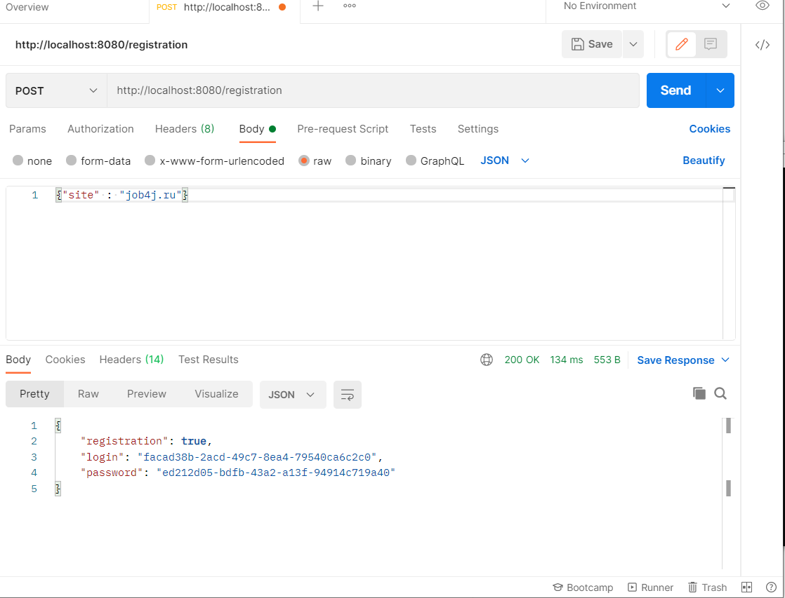
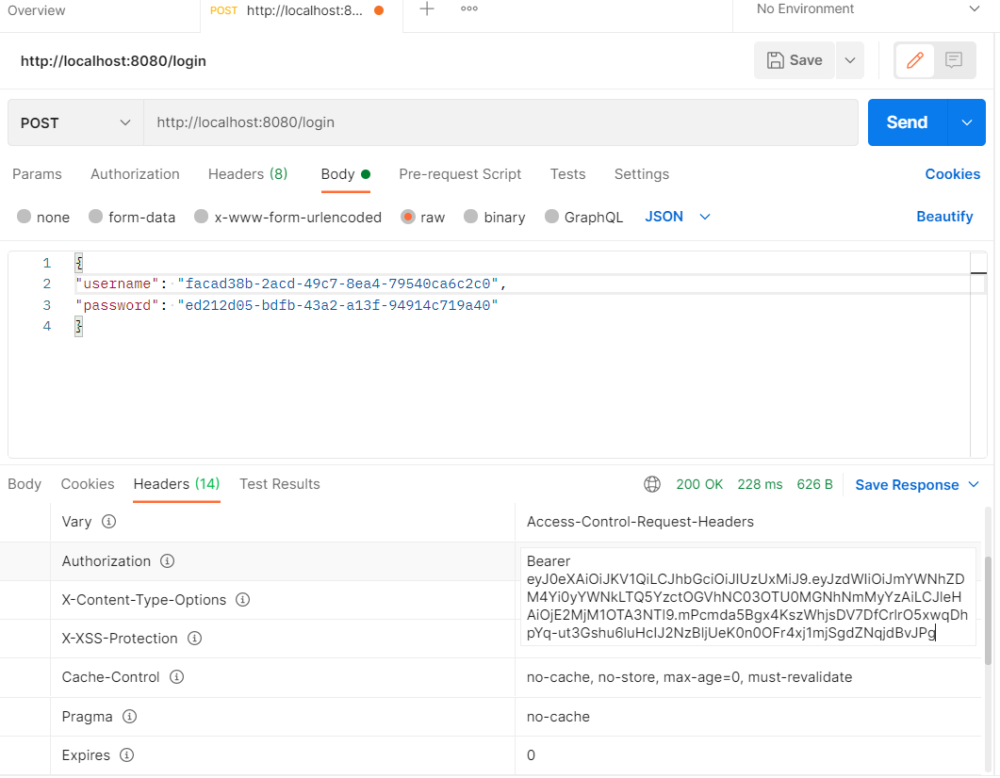
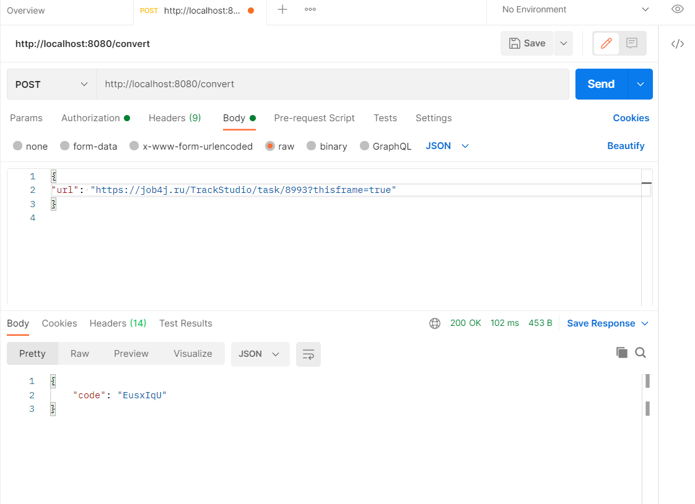
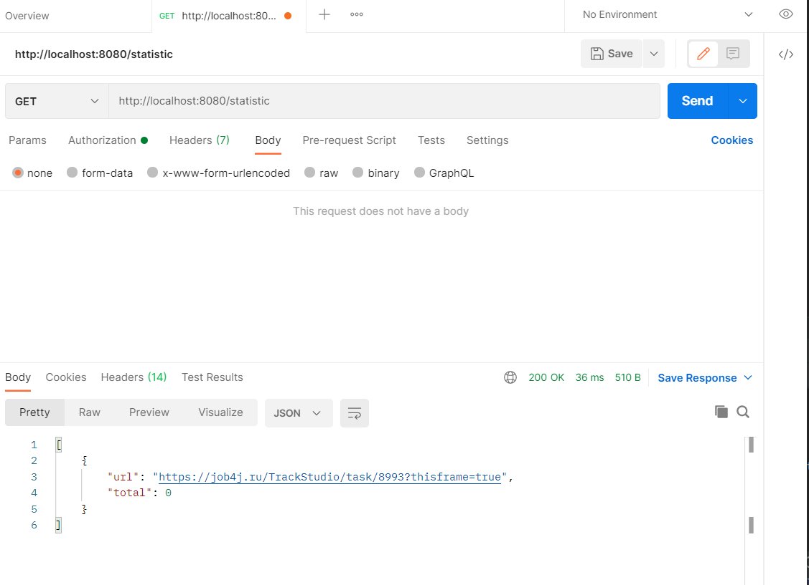

# job4j_url_shortcut
#Сервис - UrlShortCut - сервис, обеспечивающий безопасность пользователей, все ссылки на сайте заменяются ссылками на наш сервис.

Сервис работает через REST API.
Сервисом могут пользоваться разные сайты. Каждому сайту выдается пару пароль и логин.
## 1. Регистрация сайта

Чтобы зарегистрировать сайт в систему нужно отправить запроса.

URL
POST /registration
C телом JSON объекта.
{site : "job4j.ru"}
Ответ от сервера.
{registration : true/false, login: УНИКАЛЬНЫЙ_КОД, password : УНИКАЛЬНЫЙ_КОД}

Флаг registration указывает, что регистрация выполнена или нет, то есть сайт уже есть в системе.

## 2. Авторизация
Во всех остальных вызовах сервис должен проверять авторизацию пользователя.

Авторизацию сделана через JWT. Пользователь отправляет POST запрос с login и password и получает ключ.

Этот ключ отправляет в запросе в блоке HEAD.

## 3. Регистрация URL.
Поле того, как пользователь зарегистрировал свой сайт он может отправлять на сайт ссылки и получать преобразованные ссылки.

Пример.

Отправляем URL.
https://job4j.ru/TrackStudio/task/8993?thisframe=true
Получаем.

Ключ EusxIqU ассоциирован с URL.
Опишем вызовы.

POST /convert C телом JSON объекта.

{url: "https://job4j.ru/TrackStudio/task/8993?thisframe=true"}

Ответ от сервера.

{code: УНИКАЛЬНЫЙ_КОД}

## 4. Переадресация. Выполняется без авторизации.
Когда сайт отправляет ссылку с кодом в ответ нужно вернуть ассоциированный адрес и статус 302.

Опишем вызовы.

GET /redirect/УНИКАЛЬНЫЙ_КОД

Ответ от сервера в заголовке.

HTTP CODE - 302 REDIRECT URL

## 5. Статистика.
В сервисе считается количество вызовов каждого адреса.

По сайту можно получить статистку всех адресов и количество вызовов этого адреса.

Опишем вызовы.

GET /statistic Ответ от сервера JSON.

=======

